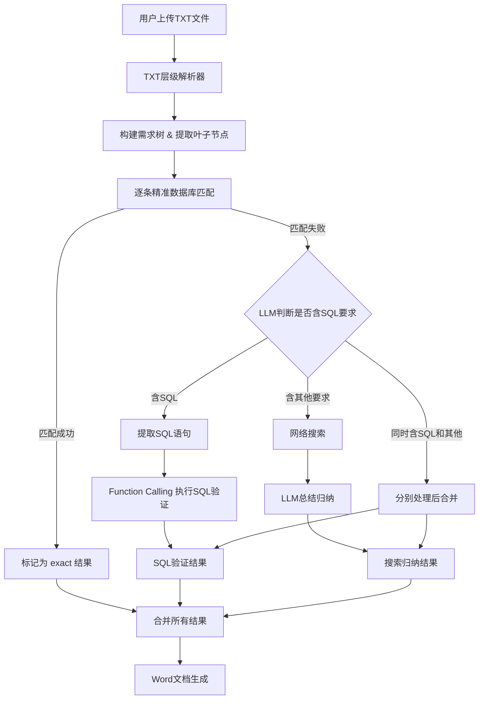
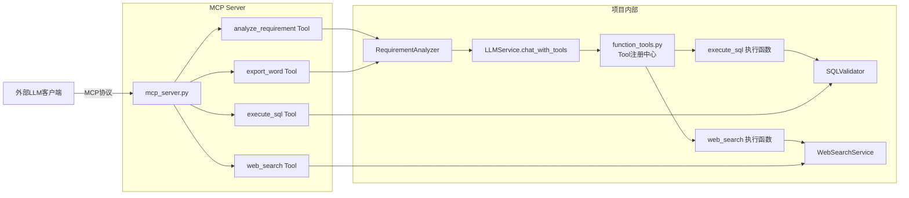

## 产品概述

完全重构LLM匹配逻辑，将当前简单的逐行TXT解析和四步匹配流程（精确→语义→网络搜索→LLM直接回答），替换为支持多级编号层级结构的TXT解析器，配合新的三阶段处理流水线（精准数据库匹配→SQL语法提取与Function Calling验证→网络搜索+LLM归纳总结），最终输出格式化Word文档。同时为所有核心能力实现两套工具体系：项目内部的LLM Function Calling Tools定义，以及独立的MCP Server供外部LLM客户端调用。

## 核心功能

1. **TXT层级解析器**：解析用户上传的层级编号TXT文件（如1.1.1.1格式），自动删除标题中的空格，构建完整的需求树结构，精确识别"最后一层"（叶子节点）作为待匹配需求项

2. **精准数据库匹配**：对每个叶子节点需求项，去现有chapters表中进行标题和内容的精准匹配（包括模糊匹配），匹配成功的直接标记结果

3. **SQL语法提取与验证**：对未匹配需求项，使用LLM识别其中是否包含SQL语法相关要求，提取SQL语句后通过LLM Function Calling/Tool Use机制调用数据库执行工具进行验证

4. **网络搜索+LLM归纳**：对未匹配需求项中的非SQL部分，进行网络搜索获取相关内容，再由LLM总结归纳生成答案

5. **Word文档生成**：将所有分析结果按层级编号结构输出为格式化Word文档（具体格式预留接口，用户稍后补充）

6. **Function Calling Tools**：为项目内部LLM调用定义标准OpenAI格式的tools（execute_sql、web_search），扩展LLMService支持Function Calling调用流程

7. **MCP Server**：实现独立的MCP Server，暴露4个核心工具供外部LLM客户端调用：SQL执行验证（execute_sql）、网络搜索（web_search）、需求分析（analyze_requirement）、Word文档生成（export_word）

## 技术栈

- **后端框架**: Flask (Python 3.12)，沿用现有项目架构
- **数据库**: MySQL + dbutils连接池（现有 `config/db_config.py`）
- **LLM调用**: 现有 `LLMService` 类（支持OpenAI/Gemini/智谱/DeepSeek/Ollama），新增Function Calling支持
- **网络搜索**: 现有 `WebSearchService`（支持Google/百度/Bing/DuckDuckGo）
- **Word生成**: python-docx（现有依赖）
- **MCP Server**: mcp Python SDK（新增依赖，使用 FastMCP 高层API）
- **SQL处理**: PyMySQL（现有依赖，用于SQL验证执行）

## 实现方案

### 总体策略

对 `requirement_analyzer.py` 进行重构，将其拆分为职责清晰的模块。新建 `sql_validator.py` 实现SQL识别验证，新建 `function_tools.py` 统一管理Function Calling的tool定义和执行逻辑，新建 `mcp_server.py` 实现MCP Server。保留现有的 `LLMService`、`WebSearchService`、数据库查询等基础设施不变。

### 关键技术决策

1. **TXT层级解析**：使用正则 `r'^(\d+(?:\.\d+)*)\s*(.+)'` 匹配所有层级编号行，构建树结构。编号中的空格全部删除。通过判断是否有子节点来识别叶子节点，而非简单按编号深度。

2. **精准匹配复用现有逻辑**：保留 `_exact_match_in_documents()` 中对chapters表的标题精确匹配和LIKE模糊匹配逻辑，去掉 `_semantic_match_in_documents()` 和 `_generate_llm_answer()`。

3. **Function Calling Tools 架构**：

- 新建 `function_tools.py` 作为tool注册中心，定义所有OpenAI格式的tool schema和对应的执行函数
- 包含 `execute_sql` tool（安全SQL执行）和 `web_search` tool（网络搜索）
- 在 `LLMService` 中新增 `chat_with_tools()` 方法，支持传入tools参数、处理tool_calls响应、执行工具函数、将结果回传LLM的完整循环
- SQL执行工具使用只读模式（SELECT直接执行，DDL/DML通过EXPLAIN验证语法），禁止危险操作

4. **MCP Server 架构**：

- 新建 `mcp_server.py`，使用 Python MCP SDK（FastMCP）实现独立MCP Server进程
- 暴露4个MCP工具：`execute_sql`（SQL验证执行）、`web_search`（网络搜索）、`analyze_requirement`（需求分析）、`export_word`（Word文档生成）
- MCP Server复用项目内部已有的业务逻辑（SQLValidator、WebSearchService、RequirementAnalyzer），避免代码重复
- 支持 stdio 传输模式，可通过命令行启动

5. **网络搜索+LLM归纳**：复用现有 `_search_from_web()` 逻辑，改进LLM归纳提示词。

6. **Word导出预留接口**：重构 `export_to_word()`，默认层级编号结构输出，预留 `format_config` 参数。

## 实现注意事项

- **性能**：精准匹配可批量化数据库查询；SQL提取先用正则预筛选再调LLM判断
- **安全**：SQL执行工具仅允许SELECT和EXPLAIN，禁止DROP/DELETE/UPDATE/INSERT/ALTER；设置执行超时；使用参数化查询
- **向后兼容**：保留现有API路由签名（/api/chat/analyze-file、/api/chat/analyze-requirements、/api/chat/export-llm-results），内部重构不影响外部调用
- **日志**：复用 `config.logging_config.logger`，关键步骤添加INFO级日志
- **错误处理**：SQL执行失败不中断整个流程，标记为"SQL验证失败"并记录错误
- **MCP Server独立性**：MCP Server作为独立进程运行，与Flask主应用解耦，通过共享底层模块实现代码复用

## 架构设计

### 系统处理流程



### Tool/MCP 架构



### 模块划分

- **RequirementTreeParser**（新逻辑在requirement_analyzer.py中）：TXT文件解析和层级树构建
- **SQLValidator**（新建sql_validator.py）：SQL识别、提取和安全执行验证
- **FunctionToolRegistry**（新建function_tools.py）：统一管理所有Function Calling tool的schema定义和执行函数映射
- **LLMService.chat_with_tools()**（扩展llm_service.py）：支持Function Calling的LLM调用
- **MCPServer**（新建mcp_server.py）：MCP Server实现，暴露4个工具
- **RequirementMatcher**（重构requirement_analyzer.py）：新三阶段匹配流水线
- **WordExporter**（重构requirement_analyzer.py）：Word文档生成

## 目录结构

```
file_process/models/
├── requirement_analyzer.py      # [MODIFY] 重构核心分析器：新增RequirementNode类和层级树构建逻辑，重写_parse_txt_requirements()为树结构解析，重写analyze_requirement()为新三阶段流水线（精准匹配→SQL验证→搜索归纳），新增_classify_and_process_unmatched()方法处理未匹配需求的SQL/非SQL分类，重写export_to_word()支持层级输出并预留format_config参数，删除_semantic_match_in_documents()和_generate_llm_answer()
├── sql_validator.py             # [NEW] SQL验证服务模块。实现SQLValidator类：detect_sql_requirements()使用正则预筛选+LLM判断需求是否含SQL要求并提取SQL语句；execute_sql_safely()通过数据库连接安全执行SQL验证（仅允许SELECT/EXPLAIN，禁止危险操作，设置超时）；get_tool_definitions()返回OpenAI格式的tool定义列表
├── function_tools.py            # [NEW] Function Calling工具注册中心。定义所有tool的OpenAI格式schema（execute_sql和web_search），实现tool执行函数映射（tool_name到callable的字典），提供get_all_tools()获取所有tool定义、execute_tool(tool_name, arguments)统一执行入口。将SQLValidator和WebSearchService的调用封装为标准tool接口
├── mcp_server.py                # [NEW] MCP Server实现。使用Python MCP SDK（FastMCP）创建独立MCP Server，注册4个工具：(1)execute_sql-在数据库中安全执行SQL验证；(2)web_search-网络搜索并返回结果；(3)analyze_requirement-对单条需求进行完整分析流程；(4)export_word-将分析结果导出为Word文档。复用SQLValidator/WebSearchService/RequirementAnalyzer的业务逻辑，支持stdio传输
├── llm_service.py               # [MODIFY] 在LLMService类中新增chat_with_tools()方法：支持OpenAI格式Function Calling，接收tools参数和tool_choice参数，处理LLM返回的tool_calls响应，调用function_tools.py中的execute_tool()执行工具函数，将工具执行结果回传LLM获取最终回答，支持多轮tool调用循环。仅扩展不影响现有chat_completion()
├── chat_db_doc.py               # [MODIFY] 更新API路由：调整/api/chat/analyze-file支持新的层级树解析返回格式；调整/api/chat/analyze-requirements传递SQL验证开关参数；调整/api/chat/export-llm-results传递层级结构信息给Word导出器
├── web_search.py                # 不修改
├── llm_config.py                # 不修改
└── ...

config/
└── app_config.py                # [MODIFY] 新增MCP Server配置项（端口等，可选）

requirements.txt                 # [MODIFY] 新增mcp依赖
```

## 关键代码结构

```python
# requirement_analyzer.py - 核心数据结构
class RequirementNode:
    """需求树节点"""
    number: str           # 编号如"1.1.1.1"
    title: str            # 标题内容（已删除空格）
    content: str          # 完整原始内容
    level: int            # 层级深度
    children: list        # 子节点列表
    parent: 'RequirementNode'
    is_leaf: bool         # 是否为叶子节点

# function_tools.py - Tool注册中心接口
class FunctionToolRegistry:
    def get_all_tools(self) -> list[dict]: ...          # 返回所有OpenAI格式tool定义
    def get_tools_by_names(self, names: list) -> list[dict]: ...
    def execute_tool(self, tool_name: str, arguments: dict) -> str: ...  # 统一执行入口

# mcp_server.py - MCP Server工具定义
@mcp.tool()
async def execute_sql(sql: str, database: str = None) -> str: ...
@mcp.tool()
async def web_search(query: str, num_results: int = 5) -> str: ...
@mcp.tool()
async def analyze_requirement(requirement: str, user_id: str, document_ids: list = None) -> str: ...
@mcp.tool()
async def export_word(results: list, title: str = '需求分析报告') -> str: ...
```

## Agent Extensions

### Skill

- **docx**
- Purpose: 在Word文档生成步骤中辅助创建格式化的Word文档，确保层级编号结构和分析结果展示区块的专业排版
- Expected outcome: 生成符合要求的层级结构Word需求分析报告

### SubAgent

- **code-explorer**
- Purpose: 在实现过程中深入探索代码库中的依赖关系和调用链，确保重构不遗漏关联点，特别是MCP Server复用业务逻辑时需要确认模块导入路径
- Expected outcome: 准确定位所有需要修改的文件和方法，避免破坏现有功能