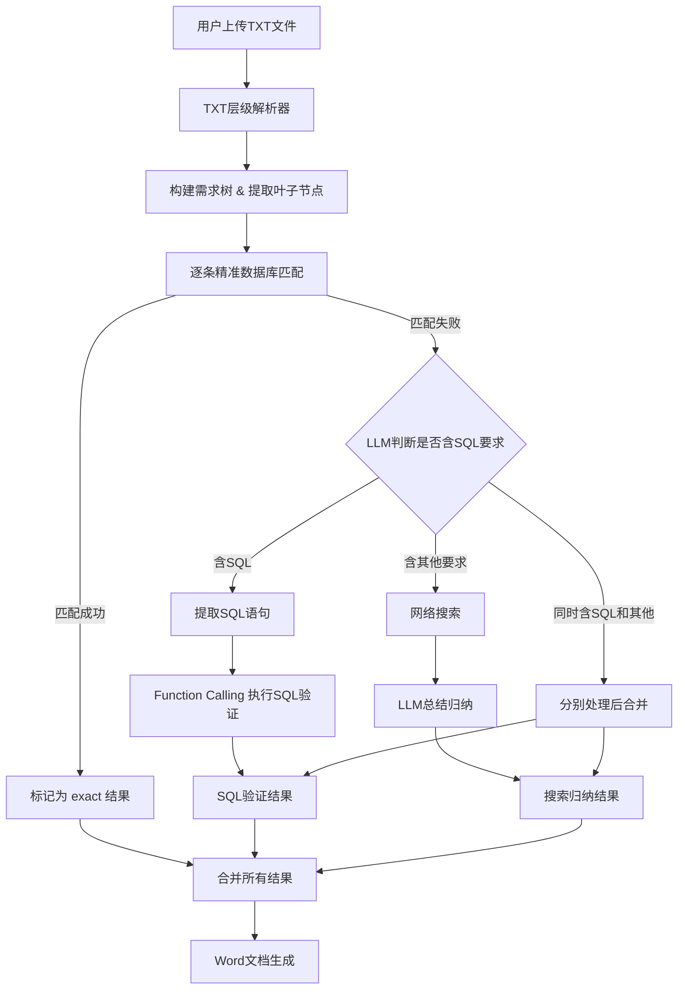

## 产品概述

完全重构LLM匹配逻辑，将当前简单的逐行TXT解析和四步匹配流程（精确→语义→网络搜索→LLM直接回答），替换为支持多级编号层级结构的TXT解析器，配合新的三阶段处理流水线（精准数据库匹配→SQL语法提取与Function Calling验证→网络搜索+LLM归纳总结），最终输出格式化Word文档。

## 核心功能

1. **TXT层级解析器**：解析用户上传的层级编号TXT文件（如1.1.1.1格式），自动删除标题中的空格，构建完整的需求树结构，并精确识别出"最后一层"（叶子节点）作为待匹配的需求项

2. **精准数据库匹配**：对每个叶子节点需求项，去现有chapters表中进行标题和内容的精准匹配（包括模糊匹配），匹配成功的直接标记结果

3. **SQL语法提取与验证**：对未匹配的需求项，使用LLM识别其中是否包含SQL语法相关要求，提取SQL语句后通过LLM Function Calling/Tool Use机制调用数据库执行工具进行验证，返回验证结果

4. **网络搜索+LLM归纳**：对未匹配需求项中的非SQL部分（或同时包含SQL和其他内容的需求项中的非SQL部分），进行网络搜索获取相关内容，再由LLM进行总结归纳生成答案

5. **Word文档生成**：将所有分析结果按照层级编号结构输出为格式化Word文档（具体格式预留接口，用户稍后补充）

## 技术栈

- **后端框架**: Flask (Python)，沿用现有项目架构
- **数据库**: MySQL + dbutils连接池（现有 `config/db_config.py`）
- **LLM调用**: 现有 `LLMService` 类（支持OpenAI/Gemini/智谱/DeepSeek/Ollama等），新增Function Calling支持
- **网络搜索**: 现有 `WebSearchService`（支持Google/百度/Bing/DuckDuckGo）
- **Word生成**: python-docx（现有依赖）
- **SQL处理**: PyMySQL（现有依赖，用于SQL验证执行）

## 实现方案

### 总体策略

对 `requirement_analyzer.py` 进行重构，将其拆分为职责清晰的模块：TXT解析器、需求匹配引擎、SQL验证工具、Word导出器。保留现有的 `LLMService`、`WebSearchService`、数据库查询等基础设施不变，在其上构建新的处理流水线。

### 关键技术决策

1. **TXT层级解析**：使用正则表达式 `r'^(\d+(?:\.\d+)*)\s*(.+)'` 匹配所有层级编号行，构建树结构。编号中的空格全部删除（如"1.1. 1"→"1.1.1"）。通过判断是否有子节点来识别"最后一层"（叶子节点），而非简单按编号深度判断。

2. **精准匹配复用现有逻辑**：保留现有 `_exact_match_in_documents()` 中对chapters表的标题精确匹配和LIKE模糊匹配逻辑，去掉语义匹配（_semantic_match_in_documents）和LLM直接回答步骤。

3. **SQL识别与Function Calling**：

- 先用LLM判断需求中是否包含SQL语法要求，并提取SQL语句
- 在 `LLMService` 中新增 `chat_with_tools()` 方法，支持OpenAI格式的Function Calling（tools参数），用于SQL验证
- SQL执行工具使用只读模式（`SELECT`语句直接执行，DDL/DML通过 `EXPLAIN` 验证语法），防止误操作
- 一个需求可能同时包含SQL要求和其他要求，需要分别处理后合并结果

4. **网络搜索+LLM归纳**：复用现有 `_search_from_web()` 的网络搜索逻辑，但改进LLM归纳提示词，使其更好地总结搜索结果。

5. **Word导出预留接口**：重构 `export_to_word()`，默认使用层级编号结构输出，同时预留 `format_config` 参数供用户后续自定义格式。

## 实现注意事项

- **性能**：批量分析时，精准匹配的数据库查询可以批量化（一次查询多个需求标题），减少数据库往返次数。SQL提取可先用简单正则预筛选，仅对可能含SQL的需求项调用LLM判断。
- **安全**：SQL执行工具必须严格限制权限 —— 只允许 SELECT 和 EXPLAIN，禁止 DROP/DELETE/UPDATE/INSERT/ALTER 等危险操作；使用参数化查询；设置执行超时。
- **向后兼容**：保留现有API路由（`/api/chat/analyze-file`、`/api/chat/analyze-requirements`、`/api/chat/export-llm-results`）的接口签名，通过内部重构改变实现。`RequirementAnalyzer` 类的公共方法签名尽量保持兼容。
- **日志**：复用现有 `config.logging_config.logger`，在关键步骤（解析完成、匹配结果、SQL执行、搜索结果）添加INFO级日志。
- **错误处理**：SQL执行失败不应中断整个流程，应标记为"SQL验证失败"并记录错误信息。

## 架构设计

### 系统处理流程



### 模块划分

- **RequirementTreeParser**（新建）：负责TXT文件解析和层级树构建
- **RequirementMatcher**（重构）：负责匹配逻辑调度（精准匹配→SQL验证→搜索归纳）
- **SQLValidator**（新建）：负责SQL识别、提取和Function Calling验证
- **LLMService.chat_with_tools()**（扩展）：支持Function Calling的LLM调用
- **WordExporter**（重构）：负责Word文档生成，支持层级结构输出

## 目录结构

```
file_process/models/
├── requirement_analyzer.py      # [MODIFY] 重构核心分析器：重写_parse_txt_requirements()为树结构解析，重写analyze_requirement()为新三阶段流水线，重写export_to_word()支持层级输出，删除_semantic_match_in_documents()和_generate_llm_answer()。保留_exact_match_in_documents()但优化查询效率。新增_classify_and_process_unmatched()方法处理未匹配需求的分类（SQL/非SQL）和分别处理逻辑。
├── sql_validator.py             # [NEW] SQL验证服务模块。实现SQLValidator类：(1) detect_sql_requirements()使用LLM判断需求是否含SQL要求并提取SQL语句；(2) validate_sql()通过Function Calling调用数据库执行SQL验证（只读模式）；(3) get_sql_tool_definition()返回OpenAI格式的tool定义。安全限制：仅允许SELECT/EXPLAIN，设置超时，禁止危险操作。
├── llm_service.py               # [MODIFY] 在LLMService类中新增chat_with_tools()方法，支持OpenAI格式的Function Calling（传入tools和tool_choice参数），处理tool_calls响应并执行对应函数，返回最终结果。仅修改_call_openai_api相关逻辑添加tools支持，不影响现有chat_completion()方法。
├── chat_db_doc.py               # [MODIFY] 更新/api/chat/analyze-file路由：调整解析逻辑以使用新的层级树解析结果。更新/api/chat/analyze-requirements路由：传递新参数支持SQL验证开关。更新/api/chat/export-llm-results路由：传递层级结构信息给Word导出器。
├── web_search.py                # 不修改，保持现有搜索功能
├── llm_config.py                # 不修改
├── bid_requirement_extractor.py # 不修改
└── ...
```

## 关键代码结构

```python
# requirement_analyzer.py 中的核心数据结构

class RequirementNode:
    """需求树节点"""
    number: str           # 编号，如 "1.1.1.1"
    title: str            # 标题内容（已删除空格）
    content: str          # 完整原始内容
    level: int            # 层级深度
    children: list        # 子节点列表
    parent: 'RequirementNode'  # 父节点
    is_leaf: bool         # 是否为叶子节点（最后一层）

# sql_validator.py 中的 Tool 定义
SQL_EXECUTE_TOOL = {
    "type": "function",
    "function": {
        "name": "execute_sql",
        "description": "在数据库中执行SQL语句进行验证，仅支持SELECT和EXPLAIN",
        "parameters": {
            "type": "object",
            "properties": {
                "sql": {"type": "string", "description": "要执行的SQL语句"},
                "database": {"type": "string", "description": "目标数据库名称"}
            },
            "required": ["sql"]
        }
    }
}
```

## Agent Extensions

### Skill

- **docx**
- Purpose: 在最终的Word文档生成步骤中，如果用户后续提供了具体的Word格式要求，可使用此skill来创建、编辑格式化的Word文档
- Expected outcome: 生成符合用户要求的层级结构Word需求分析报告

### SubAgent

- **code-explorer**
- Purpose: 在实现过程中探索代码库中的依赖关系和调用链，确保重构不遗漏关联点
- Expected outcome: 准确定位所有需要修改的文件和方法，避免破坏现有功能