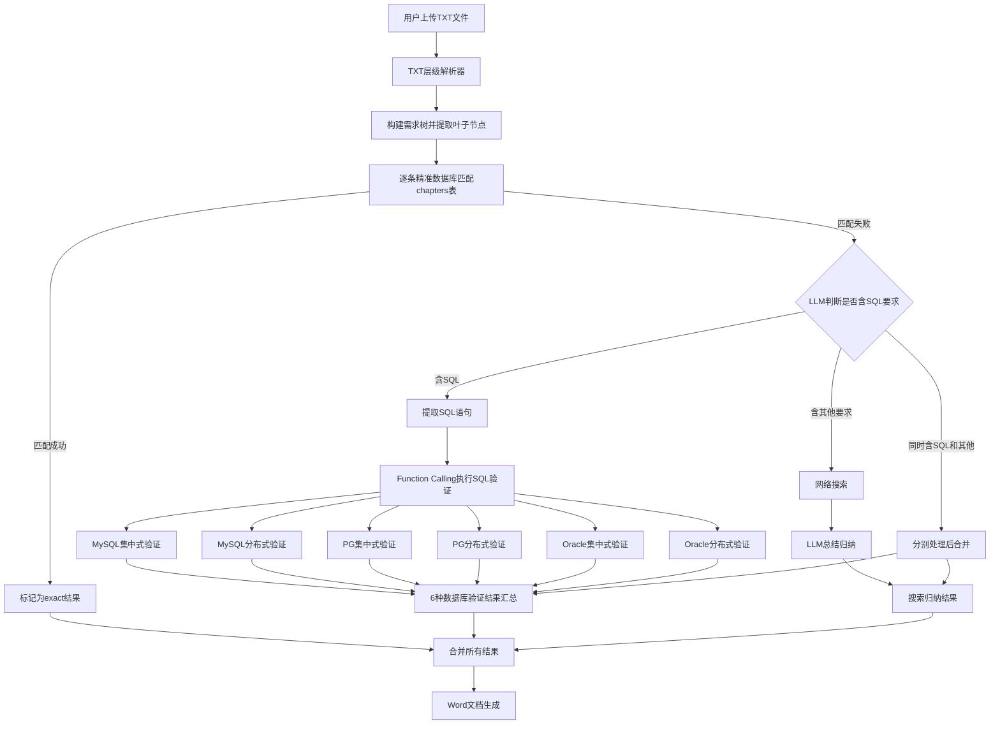
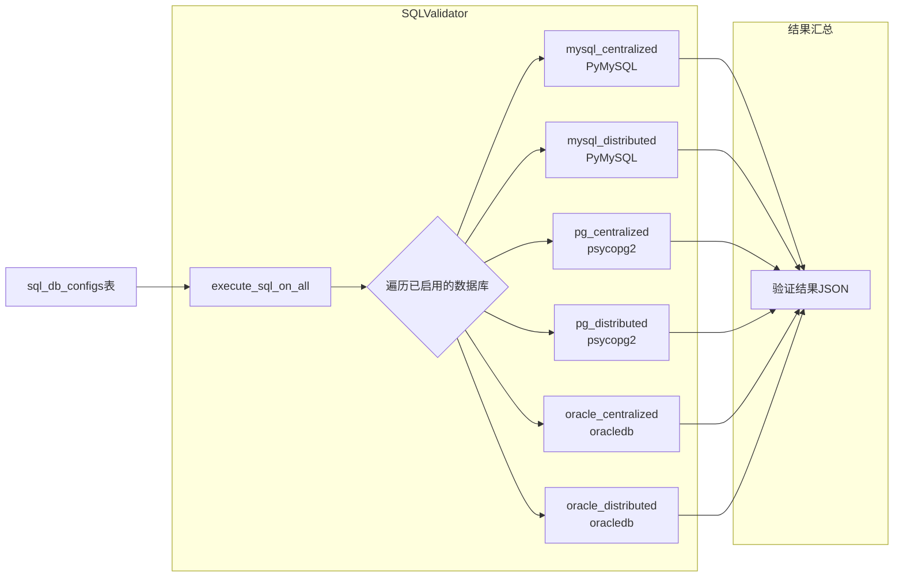

## 产品概述

完全重构LLM匹配逻辑，将当前简单的TXT解析和四步匹配流程替换为支持多级编号层级结构的TXT解析器，配合新的三阶段处理流水线（精准数据库匹配、SQL语法提取与Function Calling验证、网络搜索+LLM归纳总结），最终输出格式化Word文档。同时实现完整的内部Function Calling Tools体系和独立MCP Server，并在前端设置页面中新增MCP Server、Skills和SQL数据库连接的配置管理界面。

## 核心功能

1. **TXT层级解析器**：解析用户上传的层级编号TXT文件（如1.1.1.1格式），自动删除标题中的空格，构建完整的需求树结构，精确识别"最后一层"（叶子节点）作为待匹配需求项

2. **精准数据库匹配**：对每个叶子节点需求项，去现有chapters表中进行标题和内容的精准匹配，匹配成功的直接标记结果

3. **SQL语法提取与6种数据库验证**：对未匹配需求项，使用LLM识别其中是否包含SQL语法要求，提取SQL语句后通过LLM Function Calling机制分别在6种数据库（兼容MySQL集中式/分布式、兼容PostgreSQL集中式/分布式、兼容Oracle集中式/分布式）上执行验证，记录每种数据库的支持情况

4. **网络搜索+LLM归纳**：对未匹配需求项中的非SQL部分进行网络搜索，再由LLM总结归纳生成答案

5. **Word文档生成**：将所有分析结果按层级编号结构输出为格式化Word文档（具体格式预留接口）

6. **Function Calling Tools**：为项目内部LLM调用定义标准OpenAI格式tools（execute_sql、web_search），扩展LLMService支持Function Calling调用流程

7. **MCP Server**：实现独立MCP Server，暴露4个核心工具：SQL执行验证、网络搜索、需求分析、Word文档生成

8. **前端配置管理页面**：在现有设置面板中新增MCP Server配置、Skills配置、SQL数据库连接配置（6种数据库类型）三个模块，支持增删改查、启用/禁用、连接测试、状态展示

## 技术栈

- **后端框架**: Flask (Python 3.12)，沿用现有项目架构
- **数据库**: MySQL + dbutils连接池（现有 `config/db_config.py`）
- **LLM调用**: 现有 `LLMService` 类（支持OpenAI/Gemini/智谱/DeepSeek/Ollama），新增Function Calling支持
- **网络搜索**: 现有 `WebSearchService`（支持Google/百度/Bing/DuckDuckGo）
- **Word生成**: python-docx（现有依赖）
- **MCP Server**: mcp Python SDK（新增依赖，FastMCP高层API）
- **SQL多数据库连接**: PyMySQL（现有）、psycopg2-binary（新增，PostgreSQL）、oracledb（新增，Oracle）
- **前端**: 原生HTML/CSS/JavaScript，沿用Jinja2模板+Modal弹窗模式

## 实现方案

### 总体策略

对 `requirement_analyzer.py` 进行重构，新增 `RequirementNode` 类和树结构解析逻辑，重写匹配流水线为三阶段流程。新建 `sql_validator.py` 实现SQL识别验证（支持6种数据库类型的独立连接和执行），新建 `function_tools.py` 统一管理Function Calling的tool定义和执行逻辑，新建 `mcp_server.py` 实现MCP Server。新建 `mcp_skills_config.py` 实现MCP、Skills和SQL数据库连接的配置管理器，在 `llm_routes.py` 中新增对应API路由，在 `llm_main.html` 中新增设置面板入口和配置管理弹窗。

### 关键技术决策

**1. TXT层级解析**

使用正则 `r'^(\d+(?:\.\d+)*)[.\s]*(.+)'` 匹配所有层级编号行，编号中空格全部删除，构建树结构（`RequirementNode`类含number/title/content/level/children/parent/is_leaf属性）。通过判断是否有子节点来识别叶子节点（"最后一层"），而非简单按编号深度。

**2. SQL验证6种数据库架构**

这是最核心的新增设计。SQL验证需要支持6种数据库类型，每种独立连接配置：

| 类型标识 | 兼容协议 | 部署模式 | Python驱动 |
| --- | --- | --- | --- |
| mysql_centralized | MySQL | 集中式 | pymysql |
| mysql_distributed | MySQL | 分布式 | pymysql |
| pg_centralized | PostgreSQL | 集中式 | psycopg2 |
| pg_distributed | PostgreSQL | 分布式 | psycopg2 |
| oracle_centralized | Oracle | 集中式 | oracledb |
| oracle_distributed | Oracle | 分布式 | oracledb |


- `SQLValidator` 类持有6种数据库的连接配置（从 `sql_db_configs` 表读取），通过 `_get_connection(db_type)` 工厂方法创建对应驱动的连接
- `execute_sql_on_all(sql)` 方法依次在已启用的数据库上执行SQL，返回6项结果（支持/不支持/错误信息/执行结果）
- 安全限制：仅允许SELECT和EXPLAIN前缀，正则白名单校验，超时5秒
- Function Calling tool `execute_sql` 的参数中新增 `db_types` 可选参数，默认全部6种；返回结构化的多数据库验证结果

**3. Function Calling Tools 架构**

- `function_tools.py` 作为tool注册中心，定义 `execute_sql`（含db_types参数选择目标数据库）和 `web_search` 的OpenAI格式tool schema
- `LLMService` 新增 `chat_with_tools()` 方法：在现有 `_call_openai_api()` 的data中加入tools参数，处理response中的tool_calls，调用 `execute_tool()` 执行工具函数，将结果以 `role: tool` 消息回传LLM，支持多轮循环
- execute_sql tool返回JSON：`{db_type: {success: bool, result: str, error: str}}`

**4. MCP Server**

- 使用 `from mcp.server.fastmcp import FastMCP` 创建独立Server进程
- 注册4个工具，其中 `execute_sql` 工具支持选择目标数据库类型（默认全部6种验证）
- 复用SQLValidator/WebSearchService/RequirementAnalyzer业务逻辑
- 支持stdio传输模式

**5. 配置管理（3个新模块）**

遵循现有 `LLMConfigManager` 的CRUD模式（参数化SQL查询、软删除、默认配置切换），新建3张MySQL表：

- `mcp_server_configs`：MCP Server注册信息（名称/端口/工具列表/状态等）
- `skills_configs`：Skills配置（名称/类型/参数/状态等）
- `sql_db_configs`：6种SQL数据库连接配置（db_type/host/port/user/password/database/is_enabled等）

**6. 前端设置页面扩展**

在 `llm_main.html` 的 `.settings-body` 中新增3个 `setting-group`：

- **MCP Server配置**：状态指示灯+已注册工具数+管理按钮 → `mcpConfigModal`弹窗
- **Skills配置**：已配置数量+管理按钮 → `skillsConfigModal`弹窗
- **SQL数据库配置**：6种数据库的启用状态+管理按钮 → `sqlDbConfigModal`弹窗（含6个数据库连接表单区域，每个含host/port/user/password/database/测试连接按钮）

## 实现注意事项

- **数据库连接安全**：6种SQL数据库的连接信息（密码）存储在数据库中，API返回时脱敏（只显示前4位+****）；SQL执行仅允许SELECT/EXPLAIN白名单
- **连接池管理**：SQL验证用的6种数据库连接为按需创建短连接（非连接池），执行完立即关闭，避免占用资源；设置5秒超时
- **驱动容错**：psycopg2和oracledb为可选依赖，如果未安装则对应数据库类型标记为"驱动未安装"，不影响其他类型的验证
- **性能**：精准匹配可批量化数据库查询；SQL提取先用正则预筛选 `r'(?i)\b(SELECT|INSERT|UPDATE|DELETE|CREATE|ALTER|DROP|EXPLAIN)\b'` 再调LLM判断；6种数据库验证可并行执行（ThreadPoolExecutor）
- **向后兼容**：保留现有API路由签名不变，内部重构不影响外部调用
- **前端一致性**：新增的配置页面严格遵循现有CSS类名和Modal交互模式

## 架构设计

### 系统处理流程



### SQL验证多数据库架构



### 前端配置管理架构

```mermaid
flowchart TD
    A[设置面板 settings-panel] --> B[LLM配置]
    A --> C[Embedding配置]
    A --> D[网络搜索]
    A --> E[PaddleOCR]
    A --> F[MCP Server配置 新增]
    A --> G[Skills配置 新增]
    A --> H[SQL数据库配置 新增]
    F --> F1[mcpConfigModal弹窗]
    G --> G1[skillsConfigModal弹窗]
    H --> H1[sqlDbConfigModal弹窗<br/>6种数据库连接表单]
    F1 --> F2[/llm/mcp-config API]
    G1 --> G2[/llm/skills-config API]
    H1 --> H2[/llm/sql-db-config API]
    F2 --> F3[MCPServerConfigManager]
    G2 --> G3[SkillsConfigManager]
    H2 --> H3[SQLDBConfigManager]
    F3 --> F4[mcp_server_configs表]
    G3 --> G4[skills_configs表]
    H3 --> H4[sql_db_configs表]
```

## 目录结构

```
file_process/models/
├── requirement_analyzer.py      # [MODIFY] 重构核心分析器：新增RequirementNode类和层级树构建，重写_parse_txt_requirements()为树结构解析（支持多级编号、标题空格删除、叶子节点识别），重写analyze_requirement()为新三阶段流水线（精准匹配->SQL验证->搜索归纳），新增_classify_and_process_unmatched()处理未匹配需求的SQL/非SQL分类（一个需求可同时含SQL和其他内容需分别处理），重写export_to_word()支持层级输出并预留format_config参数，删除_semantic_match_in_documents()和_generate_llm_answer()
├── sql_validator.py             # [NEW] SQL多数据库验证服务模块。实现SQLValidator类：(1)DB_TYPES常量定义6种数据库类型标识和对应Python驱动；(2)_get_connection(db_type)工厂方法根据db_type从sql_db_configs表读取配置创建pymysql/psycopg2/oracledb连接；(3)detect_sql_requirements()使用正则预筛选+LLM判断需求是否含SQL并提取SQL语句；(4)execute_sql_safely(sql, db_type)在指定数据库上安全执行SQL（白名单校验仅允许SELECT/EXPLAIN、5秒超时）；(5)execute_sql_on_all(sql, db_types=None)在全部或指定的数据库类型上并行执行SQL返回结构化结果{db_type: {success, result, error, supported}}
├── function_tools.py            # [NEW] Function Calling工具注册中心。定义execute_sql（含db_types参数选择目标数据库类型列表，默认全部6种）和web_search的OpenAI格式tool schema，实现tool执行函数映射，提供get_all_tools()/execute_tool(tool_name, arguments)统一接口
├── mcp_server.py                # [NEW] MCP Server实现。使用FastMCP创建独立Server，注册execute_sql（含db_types参数）/web_search/analyze_requirement/export_word四个工具，复用SQLValidator/WebSearchService/RequirementAnalyzer业务逻辑，支持stdio传输，含__main__入口
├── mcp_skills_config.py         # [NEW] 三合一配置管理器。实现MCPServerConfigManager类（MCP Server的CRUD、启用禁用）、SkillsConfigManager类（Skills的CRUD、启用禁用）、SQLDBConfigManager类（6种SQL数据库连接配置的CRUD、启用禁用、连接测试），均遵循现有LLMConfigManager模式使用参数化SQL
├── llm_service.py               # [MODIFY] 新增chat_with_tools()方法：基于_call_openai_api扩展，在请求data中加入tools和tool_choice参数，解析response中的tool_calls字段，调用function_tools.execute_tool()执行工具，以role:tool消息回传LLM，循环直到获得最终文本回答（最多5轮）
├── llm_routes.py                # [MODIFY] 新增3组API路由：(1)MCP配置 /llm/mcp-config GET/POST及/<id> PUT/DELETE；(2)Skills配置 /llm/skills-config 同理；(3)SQL数据库配置 /llm/sql-db-config GET/POST/PUT/DELETE及/test测试连接；每组遵循现有LLM配置路由的参数验证和错误处理模式
├── chat_db_doc.py               # [MODIFY] 更新/api/chat/analyze-file路由适配新层级树解析返回格式，更新/api/chat/analyze-requirements传递SQL验证参数（启用哪些数据库类型），更新/api/chat/export-llm-results传递层级结构
├── web_search.py                # 不修改
├── llm_config.py                # 不修改
└── ...

file_process/templates/
└── llm_main.html                # [MODIFY] 设置面板中新增3个setting-group（MCP Server配置含状态灯和工具数、Skills配置含配置数量、SQL数据库配置含6种数据库启用状态指示），新增3个Modal弹窗（mcpConfigModal、skillsConfigModal、sqlDbConfigModal含6个数据库连接表单区+测试连接按钮），新增对应CSS样式和JavaScript管理函数

config/
└── app_config.py                # [MODIFY] 新增SQL数据库默认配置项（可选）

requirements.txt                 # [MODIFY] 新增mcp、psycopg2-binary、oracledb依赖
```

## 关键代码结构

```python
# requirement_analyzer.py - RequirementNode数据结构
class RequirementNode:
    """需求树节点"""
    number: str           # 编号如"1.1.1.1"
    title: str            # 标题内容（已删除空格）
    content: str          # 完整原始内容
    level: int            # 层级深度
    children: list        # 子节点列表
    parent: 'RequirementNode'
    is_leaf: bool         # 是否为叶子节点

# sql_validator.py - 6种数据库类型定义和验证结果
DB_TYPES = {
    'mysql_centralized':  {'name': '兼容MySQL集中式',  'driver': 'pymysql',   'protocol': 'mysql'},
    'mysql_distributed':  {'name': '兼容MySQL分布式',  'driver': 'pymysql',   'protocol': 'mysql'},
    'pg_centralized':     {'name': '兼容PG集中式',     'driver': 'psycopg2',  'protocol': 'postgresql'},
    'pg_distributed':     {'name': '兼容PG分布式',     'driver': 'psycopg2',  'protocol': 'postgresql'},
    'oracle_centralized': {'name': '兼容Oracle集中式', 'driver': 'oracledb',  'protocol': 'oracle'},
    'oracle_distributed': {'name': '兼容Oracle分布式', 'driver': 'oracledb',  'protocol': 'oracle'},
}

class SQLValidator:
    def execute_sql_on_all(self, sql: str, db_types: list = None) -> dict: ...
    # 返回: {db_type: {'success': bool, 'supported': bool, 'result': str, 'error': str}}

# function_tools.py - execute_sql tool schema (含db_types参数)
EXECUTE_SQL_TOOL = {
    "type": "function",
    "function": {
        "name": "execute_sql",
        "description": "在数据库中执行SQL语句进行验证，支持6种数据库类型",
        "parameters": {
            "type": "object",
            "properties": {
                "sql": {"type": "string", "description": "要执行的SQL语句"},
                "db_types": {
                    "type": "array",
                    "items": {"type": "string", "enum": [...]},
                    "description": "要验证的数据库类型列表，默认全部6种"
                }
            },
            "required": ["sql"]
        }
    }
}
```

## Agent Extensions

### Skill

- **docx**
- Purpose: 在Word文档生成步骤中辅助创建格式化的Word文档，确保层级编号结构和多数据库SQL验证结果表格的专业排版
- Expected outcome: 生成包含层级需求结构、匹配结果、6种数据库SQL验证结果对比表的Word需求分析报告

### SubAgent

- **code-explorer**
- Purpose: 在实现过程中深入探索代码库中的依赖关系和调用链，特别是requirement_analyzer.py中2054行代码的方法调用关系，确保重构不遗漏关联点
- Expected outcome: 准确定位所有需要修改的文件和方法，避免破坏现有功能