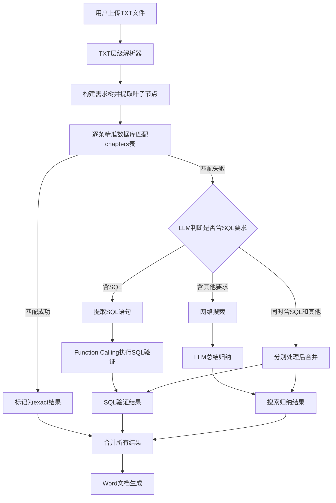
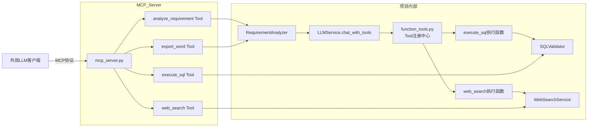

## 产品概述

完全重构LLM匹配逻辑，将当前简单的逐行TXT解析和四步匹配流程替换为支持多级编号层级结构的TXT解析器，配合新的三阶段处理流水线（精准数据库匹配、SQL语法提取与Function Calling验证、网络搜索+LLM归纳总结），最终输出格式化Word文档。同时实现完整的内部Function Calling Tools体系和独立MCP Server，并在前端设置页面中新增MCP Server和Skills的配置管理界面。

## 核心功能

1. **TXT层级解析器**：解析用户上传的层级编号TXT文件（如1.1.1.1格式），自动删除标题中的空格，构建完整的需求树结构，精确识别"最后一层"（叶子节点）作为待匹配需求项

2. **精准数据库匹配**：对每个叶子节点需求项，去现有chapters表中进行标题和内容的精准匹配，匹配成功的直接标记结果

3. **SQL语法提取与验证**：对未匹配需求项，使用LLM识别其中是否包含SQL语法相关要求，提取SQL语句后通过LLM Function Calling机制调用数据库执行工具进行验证

4. **网络搜索+LLM归纳**：对未匹配需求项中的非SQL部分进行网络搜索获取相关内容，再由LLM总结归纳生成答案

5. **Word文档生成**：将所有分析结果按层级编号结构输出为格式化Word文档（具体格式预留接口）

6. **Function Calling Tools**：为项目内部LLM调用定义标准OpenAI格式的tools（execute_sql、web_search），扩展LLMService支持Function Calling

7. **MCP Server**：实现独立的MCP Server，暴露4个核心工具：SQL执行验证、网络搜索、需求分析、Word文档生成

8. **MCP/Skills前端配置页面**：在现有设置面板中新增MCP Server配置管理和Skills配置管理两个模块，支持增删改查、启用/禁用、状态展示，包含对应的管理弹窗

## 技术栈

- **后端框架**: Flask (Python 3.12)，沿用现有项目架构
- **数据库**: MySQL + dbutils连接池（现有 `config/db_config.py`）
- **LLM调用**: 现有 `LLMService` 类（支持OpenAI/Gemini/智谱/DeepSeek/Ollama），新增Function Calling支持
- **网络搜索**: 现有 `WebSearchService`（支持Google/百度/Bing/DuckDuckGo）
- **Word生成**: python-docx（现有依赖）
- **MCP Server**: mcp Python SDK（新增依赖，使用 FastMCP 高层API）
- **前端**: 原生HTML/CSS/JavaScript，沿用现有Jinja2模板+Modal弹窗模式

## 实现方案

### 总体策略

对 `requirement_analyzer.py` 进行重构，新增 `RequirementNode` 类和树结构解析逻辑，重写匹配流水线为三阶段流程。新建 `sql_validator.py` 实现SQL识别验证，新建 `function_tools.py` 统一管理Function Calling的tool定义和执行逻辑，新建 `mcp_server.py` 实现MCP Server。新建 `mcp_skills_config.py` 实现MCP和Skills的数据库配置管理器，在 `llm_routes.py` 中新增对应API路由，在 `llm_main.html` 中新增设置面板入口和配置管理弹窗。

### 关键技术决策

1. **TXT层级解析**：使用正则 `r'^(\d+(?:\.\d+)*)[.\s]*(.+)'` 匹配所有层级编号行，编号中空格全部删除，构建树结构。通过判断是否有子节点来识别叶子节点（"最后一层"），而非简单按编号深度。

2. **精准匹配复用现有逻辑**：保留 `_exact_match_in_documents()` 中对chapters表的标题精确匹配和LIKE模糊匹配，去掉 `_semantic_match_in_documents()` 和 `_generate_llm_answer()`。

3. **Function Calling Tools 架构**：

- 新建 `function_tools.py` 作为tool注册中心，定义所有OpenAI格式的tool schema和对应的执行函数
- 在 `LLMService._call_openai_api()` 基础上扩展 `chat_with_tools()` 方法，在data中加入tools参数，处理response中的tool_calls，执行工具函数后将结果回传LLM，支持多轮循环
- SQL执行工具使用只读模式（SELECT直接执行，DDL/DML通过EXPLAIN验证），禁止危险操作

4. **MCP Server 架构**：

- 使用 Python MCP SDK（`from mcp.server.fastmcp import FastMCP`）创建独立Server
- 注册4个工具：execute_sql、web_search、analyze_requirement、export_word
- 复用项目内部已有的SQLValidator、WebSearchService、RequirementAnalyzer业务逻辑
- 支持stdio传输模式，作为独立进程运行

5. **MCP/Skills配置管理**：

- 新建 `mcp_skills_config.py`，实现 `MCPServerConfigManager` 和 `SkillsConfigManager` 两个配置管理器类，遵循现有 `LLMConfigManager` 的CRUD模式（含软删除、默认配置、参数化查询）
- 需要新建两张MySQL表：`mcp_server_configs` 和 `skills_configs`
- 前端沿用现有设置面板中setting-group + Modal弹窗的交互模式，在设置面板中新增两个分组入口，各自对应一个管理弹窗

6. **前端设置页面扩展**：

- 在 `llm_main.html` 的 `.settings-body`（第813行之后）新增两个 `setting-group`：MCP Server配置（含状态指示灯+管理按钮）和Skills配置（含列表展示+管理按钮）
- 新增两个Modal弹窗（`mcpConfigModal`、`skillsConfigModal`），沿用configModal的表单结构
- 新增对应的JavaScript管理函数（loadMCPConfigs/saveMCPConfig/loadSkillsConfigs/saveSkillConfig等），遵循现有loadLLMConfigs/saveConfig的fetch API调用模式

## 实现注意事项

- **性能**：精准匹配可批量化数据库查询，减少往返次数；SQL提取先用正则预筛选 `r'(?i)\b(SELECT|INSERT|UPDATE|DELETE|CREATE|ALTER|DROP|EXPLAIN)\b'` 再调LLM判断；MCP Server作为独立进程不影响Flask主应用性能
- **安全**：SQL执行工具仅允许SELECT和EXPLAIN，正则白名单校验禁止DROP/DELETE/UPDATE/INSERT/ALTER等危险操作；设置执行超时（5秒）；所有数据库操作使用参数化查询（%s占位符）
- **向后兼容**：保留现有API路由签名不变（/api/chat/analyze-file、/api/chat/analyze-requirements、/api/chat/export-llm-results），通过内部重构改变实现
- **日志**：复用现有 `config.logging_config.logger`，在关键步骤添加INFO级日志
- **错误处理**：SQL执行失败不中断整个流程，标记为"SQL验证失败"并记录错误；MCP Server工具调用异常返回错误描述而非抛异常
- **前端一致性**：新增的MCP/Skills配置页面严格遵循现有的CSS类名（setting-group、modal、modal-content、config-list、form-group、btn-primary等）和JavaScript交互模式，保持UI风格统一

## 架构设计

### 系统处理流程



### Tool/MCP 架构



### 前端配置管理架构

```mermaid
flowchart TD
    A[设置面板 settings-panel] --> B[LLM配置 setting-group]
    A --> C[Embedding配置 setting-group]
    A --> D[网络搜索 setting-group]
    A --> E[PaddleOCR setting-group]
    A --> F[MCP Server配置 setting-group 新增]
    A --> G[Skills配置 setting-group 新增]
    F --> H[mcpConfigModal弹窗]
    G --> I[skillsConfigModal弹窗]
    H --> J[/llm/mcp-config API]
    I --> K[/llm/skills-config API]
    J --> L[MCPServerConfigManager]
    K --> M[SkillsConfigManager]
    L --> N[mcp_server_configs表]
    M --> O[skills_configs表]
```

## 目录结构

```
file_process/models/
├── requirement_analyzer.py      # [MODIFY] 重构核心分析器：新增RequirementNode类和层级树构建，重写_parse_txt_requirements()为树结构解析（支持多级编号、标题空格删除、叶子节点识别），重写analyze_requirement()为新三阶段流水线（精准匹配→SQL验证→搜索归纳），新增_classify_and_process_unmatched()处理未匹配需求的SQL/非SQL分类，重写export_to_word()支持层级输出并预留format_config参数，删除_semantic_match_in_documents()和_generate_llm_answer()
├── sql_validator.py             # [NEW] SQL验证服务模块。实现SQLValidator类：detect_sql_requirements()使用正则预筛选+LLM判断需求是否含SQL要求并提取SQL语句；execute_sql_safely()通过数据库连接安全执行SQL验证（仅允许SELECT/EXPLAIN，禁止危险操作，设置超时）；返回执行结果或语法验证结果
├── function_tools.py            # [NEW] Function Calling工具注册中心。定义execute_sql和web_search的OpenAI格式tool schema，实现tool执行函数映射，提供get_all_tools()获取所有tool定义、execute_tool(tool_name, arguments)统一执行入口
├── mcp_server.py                # [NEW] MCP Server实现。使用FastMCP创建独立Server，注册execute_sql/web_search/analyze_requirement/export_word四个工具，复用SQLValidator/WebSearchService/RequirementAnalyzer业务逻辑，支持stdio传输，含__main__入口
├── mcp_skills_config.py         # [NEW] MCP和Skills配置管理器。实现MCPServerConfigManager类（MCP Server配置的CRUD、启用/禁用、连接测试）和SkillsConfigManager类（Skills配置的CRUD、启用/禁用），遵循现有LLMConfigManager模式，使用参数化SQL查询
├── llm_service.py               # [MODIFY] 在LLMService类中新增chat_with_tools()方法：基于_call_openai_api扩展，支持传入tools和tool_choice参数，处理LLM返回的tool_calls响应，调用function_tools.py中的execute_tool()执行工具函数，将结果回传LLM，支持多轮循环直到获得最终回答
├── llm_routes.py                # [MODIFY] 新增MCP和Skills配置管理API路由：/llm/mcp-config（GET/POST）列出和创建MCP配置，/llm/mcp-config/<id>（PUT/DELETE）更新和删除，/llm/mcp-config/<id>/toggle启用禁用，/llm/mcp-config/test测试连接；Skills同理
├── chat_db_doc.py               # [MODIFY] 更新/api/chat/analyze-file路由适配新的层级树解析返回格式，更新/api/chat/analyze-requirements传递SQL验证开关参数，更新/api/chat/export-llm-results传递层级结构信息
├── web_search.py                # 不修改
├── llm_config.py                # 不修改
└── ...

file_process/templates/
└── llm_main.html                # [MODIFY] 设置面板中新增两个setting-group（MCP Server配置、Skills配置），新增两个Modal弹窗（mcpConfigModal、skillsConfigModal），新增对应的CSS样式和JavaScript管理函数（load/save/delete/toggle）

config/
└── app_config.py                # [MODIFY] 新增MCP Server默认配置项（可选）

requirements.txt                 # [MODIFY] 新增mcp依赖
```

## 关键代码结构

```python
# requirement_analyzer.py - RequirementNode数据结构
class RequirementNode:
    """需求树节点"""
    number: str           # 编号如"1.1.1.1"
    title: str            # 标题内容（已删除空格）
    content: str          # 完整原始内容
    level: int            # 层级深度
    children: list        # 子节点列表
    parent: 'RequirementNode'
    is_leaf: bool         # 是否为叶子节点

# function_tools.py - Tool注册中心接口
class FunctionToolRegistry:
    def get_all_tools(self) -> list[dict]: ...
    def get_tools_by_names(self, names: list[str]) -> list[dict]: ...
    def execute_tool(self, tool_name: str, arguments: dict) -> str: ...

# mcp_server.py - MCP Server工具签名
@mcp.tool()
async def execute_sql(sql: str, database: str = None) -> str: ...
@mcp.tool()
async def web_search(query: str, num_results: int = 5) -> str: ...
@mcp.tool()
async def analyze_requirement(requirement: str, document_ids: list = None) -> str: ...
@mcp.tool()
async def export_word(results: list, title: str = '需求分析报告') -> str: ...
```

## Agent Extensions

### Skill

- **docx**
- Purpose: 在Word文档生成步骤中辅助创建格式化的Word文档，确保层级编号结构和分析结果展示区块的专业排版
- Expected outcome: 生成符合要求的层级结构Word需求分析报告

### SubAgent

- **code-explorer**
- Purpose: 在实现过程中深入探索代码库中的依赖关系和调用链，确保重构不遗漏关联点，特别是MCP Server复用业务逻辑时需要确认模块导入路径
- Expected outcome: 准确定位所有需要修改的文件和方法，避免破坏现有功能